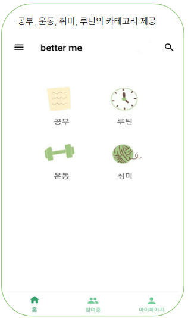
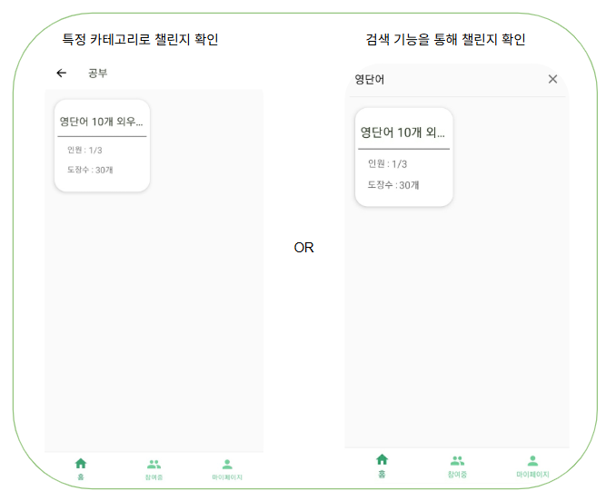
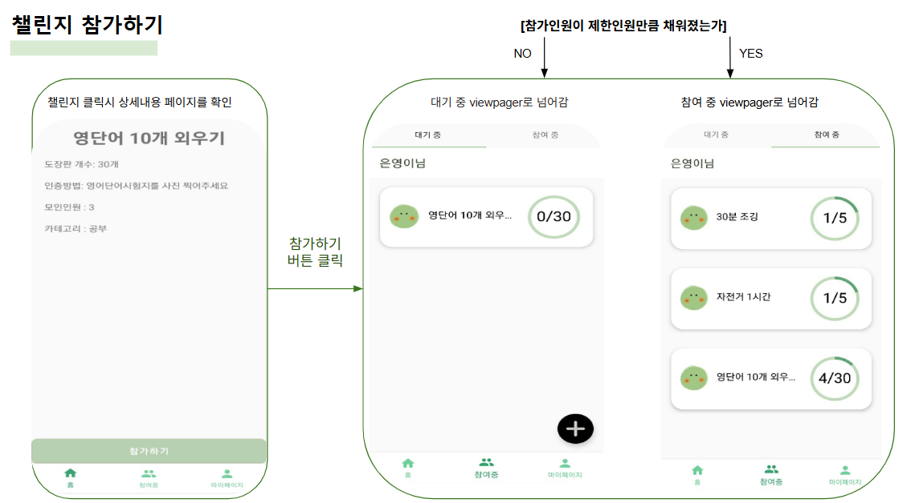
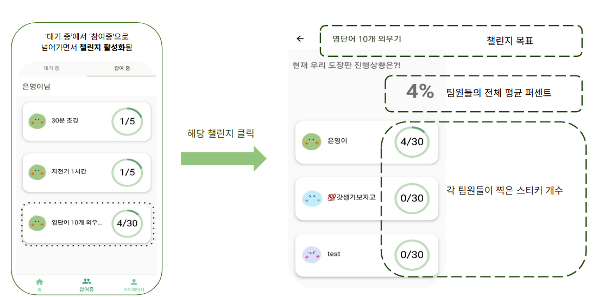

#  Better Me: 목표 달성 도장판 애플리케이션

## 📌 프로젝트 개요

**Better Me**는 MZ세대의 '건강한 챌린지 문화'를 지원하기 위해 개발된 목표 달성 도장판 애플리케이션입니다. 사용자는 다양한 카테고리의 챌린지를 생성하고 참여하며, 시각적인 도장판을 통해 목표를 달성하는 재미와 동기부여를 제공합니다.

---

## 🎯 주요 기능

- **회원가입 및 로그인**: Firebase 인증을 통한 사용자 관리
- **챌린지 생성 및 참여**: 다양한 카테고리의 챌린지를 생성하고 참여
- **도장판 시스템**: 개인 및 그룹별 도장판 생성, 스티커 추가, 진행 상황 시각화
- **그룹/개인 모드 전환**: 그룹 챌린지와 개인 챌린지 간 전환 기능
- **SNS 공유**: 진행 상황을 SNS에 공유하여 동기부여
- **알림 기능**: 챌린지 진행 상황에 대한 알림 제공
- **뷰페이저 구현**: 진행 중인 챌린지와 완료된 챌린지를 구분하여 표시

---

## 🎯 프로젝트 목표

- **다양한 챌린지**: 다양한 카테고리의 챌린지를 개설할 수 있습니다.
- **시각적 동기부여**: 눈에 보기 쉬운 UI를 위해 도장판 형태의 기능을 활용하여 시각적 효과를 높였습니다.
- **완료 독려**: 챌린지 완료까지 참여자들에게 귀여운 스티커, SNS 공유, 알람 등의 동기부여 시스템을 제공합니다.
  
---

## 🛠 기술 스택

- **언어**: Java
- **개발 환경**: Android Studio
- **백엔드**: Firebase (인증, 실시간 데이터베이스, 알림)
- **UI 구성**: RecyclerView, ViewPager, Fragment, 페이저 어댑터

---

## 📱 앱 흐름

1. **챌린지 탐색 및 참여**
   - 메인 화면에서 카테고리 선택 또는 검색 기능을 통해 챌린지를 찾고 참여
   - 챌린지 모집 인원이 마감되었거나, 개설자가 모집을 마감했을 경우 참여할 수 없습니다.
      
     
      
     
      
     
      
 
2. **도장판 활용**
   - 참여한 챌린지의 도장판에 스티커를 추가하여 진행 상황을 기록
     
    
     
    
     

3. **그룹/개인 모드 전환**
   - 그룹 챌린지와 개인 챌린지 간 전환하여 다양한 방식으로 참여

4. **SNS 공유 및 알림**
   - 진행 상황을 SNS에 공유하고, 알림을 통해 동기부여 유지

---

## 개발 중 어려웠던 점과 해결 과정

이 프로젝트를 개발하면서 가장 어려웠던 부분은 Firebase의 NoSQL 데이터베이스를 활용해 챌린지 도장판과 커뮤니티 기능을 구현하는 것이었습니다.
 
특히, 목표한 칸수만큼 도장판을 생성하고 다음 도장판을 보여주는 형태의 구현 자료가 많지 않아 어려움을 겪었습니다.

### Firebase Realtime Database 활용

파이어베이스에 uid기준으로 저장한 데이터들을 전부 불러와 사용하는 자료가 부족해서 어려움을 겪었습니다.
 
데이터베이스에서 데이터를 읽을 때마다 **DataSnapshot**으로 데이터를 받고 필요한 정보만 파싱하는 방법으로 해결.
 
이를 통해 데이터를 효율적으로 처리하고, 필요한 정보를 정확하게 가져올 수 있었습니다.
